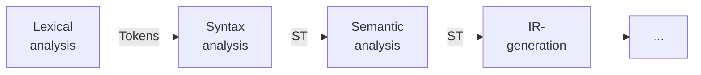
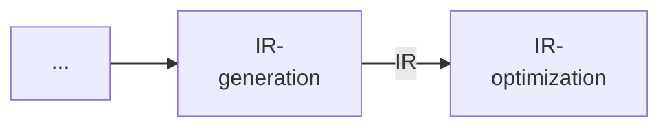
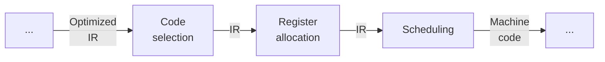

Drei Phasen:

(IR=Intermediate representation; Ziel: $n * m$-Compiler mit $n+m$ Komponenten bauen)

## Frontend
- Gültiger Code --> IR, typischerweise target-unabhängig
- Komplexität $O(n) - O(n \log n)$

### Aufbau

- Lexical ([[Scanner]]): Mappt Zeichenstrom in Wörter (tokens)
- Syntax (parser): Erkennt _Sätze aus tokens_ einer Grammatik, erzeugt Syntax-Tree (ST)
- Semantic analysis: Fügt Informationen und Checks hinzu (Typen, Deklarationen,…)
- IR-Generierung: Abstrakte Repräsentation des Codes, geeigenet zur Codegeneration (z.B. ST)

## Middle-End
- Optimierung

### Aufbau

- IR-Optimierung: Vereinfachungen und Verbesserungen (z.B. Redundanzen entfernen)

## Backend
- IR --> Target-Code (-> target-abhängig)
- Komplexität typ. NP-vollständig

- Code selection: Welche Instruktionen sollen IR implementieren?
- Register allocation: In welchen Registern Variablen platzieren?
- Scheduling: Wann Instruktionen ausführen? (Ordnen des Assembly-Codes unter Berücksichtigungen der Schnittstellen und Einschränkungen)