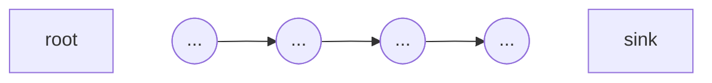

## Definitionen
### Fan-in
- In-Grad eines Knotens in einer bestimmten Relation
- $\text{Fan-in}(n=0)$: $n$ ist *Stamm*knoten (Quelle)
- $\text{Fan-in}(n) > 0$: $n$ ist *erreichbar* von anderen Knoten

### Fan-out
- Out-Grad eines Knoten in bestimmter Relation
- $\text{Fan-out}(n)=0$: $n$ ist *Blatt*knoten (Senke)
- Ein *innerer Knoten* ist weder Stamm noch Blatt

### Pfad
- Ein Pfad $p = (n_1, n_2, …, n_k)$ ist eine Knotensequenz der Länge $k$

## Liste

- eine Quelle (root), eine Senke
- alle anderen Knoten haben $\text{Fan-in}=1,\;\text{Fan-out}=1$
- Stellt eine absolute Reihenfolge da (Sequenzialisierung)
- Gibt Priorisierung, Ausführungsreihenfolge, …

## Bäume

- eine Quelle (root), viele Blätter (sinks)
- Jeder Knoten hat $\text{Fan-in}=1$
- *Hierarchische Abstraktion*: Ein Knoten abstrahiert/stellt alle Knoten eines Unterbaums dar
-> SA-Funktionsbäume, Organisationsbäume

## Directed Acyclic Graph (DAG)

- Viele Senken, viele Quellen (`außer Jungle = DAG mit 1 root`)
- $\text{Fan-in}, \text{Fan-out}$ beliebig
- Stellt eine *teilweise Reihenfolge* dar, weniger Beschränkungen als absolute Reihenfolge
- schwächere hierarchische Abstraktion; kann geschichtet werden
- UML-Vererbungsgraphen, Vererbungsgitter

## Link Tree

ist ein Skelettbaum (primär) mit einem überlagertem Graph (sekundär)
- Vorteile: Baum kann als konzeptionelle Hierarchie verwendet werden, Referenzen auf andere Teile möglich
-> XML, AST mit Namensbeziehungen nach Namensanalyse

## Reduzibler Graph

ist ein Graph mit Zyklen, aber nur zwischen Geschwistern (auf einer Ebene)
- Graph kann zu einem Knoten reduziert werden
-> UML statecharts, Kontrollflussgraphen von Ada, Java, SA DFG, refined Petri Nets

> [!example]- Reduzierung
> ![[Pasted image 20240207132617.png]]

## Layerable Graphs
wie [[#Reduzibler Graph]], jedoch geteilt mit unterschiedlichen Teilen des Skeleton Trees
- Kann nicht auf einen Knoten reduziert werden
- Skeleton kann verwendet werden um den Graph zu schichten/layer
- Zyklen nur innerhalb einer Schicht
-> geschichtete Systemarchitektur

![[Pasted image 20240207132926.png]]

## Wild unstrukturierte (gerichtete) Graphen
schlimmstmögliche Struktur
- wilde, unstrukturierte, unreduzible Zyklen
- nicht schichtbar, keine Abstraktion möglich
- keine Übersicht möglich
- viele Quellen (roots), viele Senken (leafs)
-> UML Klassendiagramme
![[Pasted image 20240207133131.png]]

## Flashcards

Welche grundlegenden Graphen gibt es + wichtigste Eigenschaften? #flashcard #graphen
- Liste/Kette - 1 Quelle, 1 Senke, alle anderen 1 fan-in, 1 fan-out -> Priorisier./Reihenfolge
- Bäume - 1 Quelle, viele Senken, alle haben fan-in <= 1 -> Hierarchie
- DAG - viele Quellen & Senken, fan-in/-out beliebig, Schichten, keine Zyklen (UML inheritance DAGs, Compiler)
- Link Tree - primärer Skeleton Tree, sekundärer overlay graph -> konzeptuelle Hierarchie mit möglichen Referenzen (HTML, XML)
- Reduzibler Graph - Zyklen auf einer Ebene/zw. Geschwistern möglich, kann auf einen Knoten reduziert werden (UML Statecharts, PNs, OO Vererbungshierarchie)
- Layerable Graph - wie reduzibler Graph, kann nicht auf 1 Knoten reduziert werden, aber geschichtet werden
- Wild unstructured Graph - nicht schichtbar, keine Abstraktion mgl. (UML Klassendiagramme)
- - -
